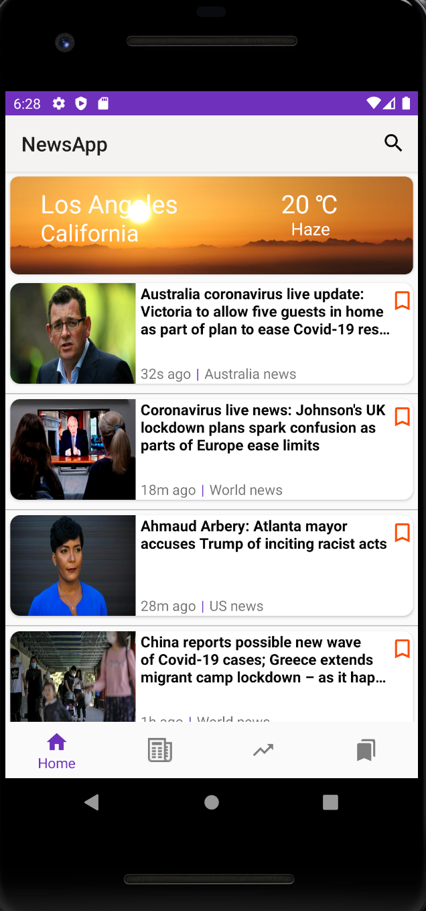
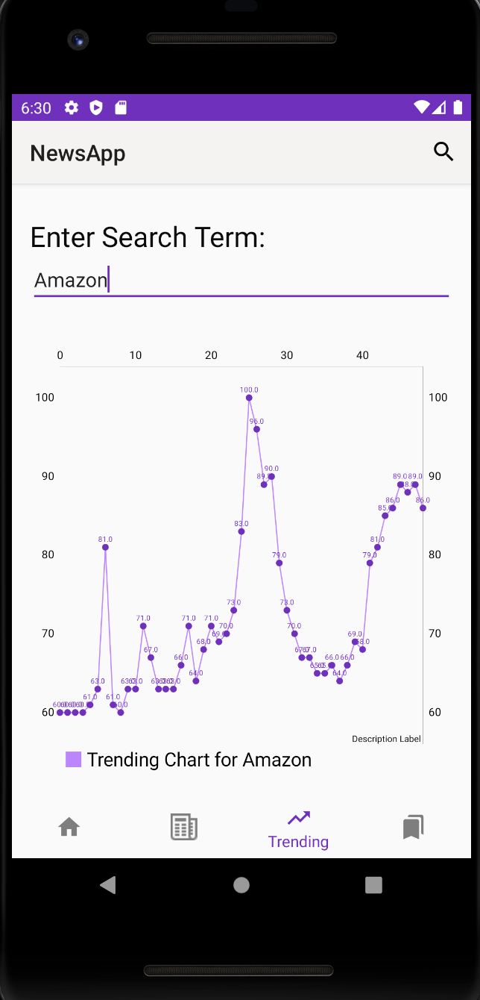

# Android-NewsApp

# Synopsis

This project was completed as a part of my coursework for the course CSCI 571: Web Technologies at the University of Southern California, Spring 2020 under Prof. Marco Papa.

## Why?

## Installation Guide
The app can be installed and tested in 5 steps:
1. Install [Android Studio](https://developer.android.com/studio) on your machine.
2. Create an [Android Virtual Device (AVD)](https://developer.android.com/studio/run/managing-avds) in your Android Studio.
3. Clone the Android-NewsApp repo to your local machine.
4. Open the cloned local project in Android Studio.
5. Run the app.

## Screenshots

    
<h2>HomePage displaying news and current weather</h2>

<h2>Detailed Version of news</h2>

<h2>Section-Wise News</h2>

<h2>Trending Chart </h2>

<h2>Bookmarking functionality</h2>

<h2>Search Results</h2>

  
### Tech Stack of this Project:

* Front-end: Android(Java)
* Dependencies:laravel api of news app, NYTimes News API, Twitter API, Facebook API, Trending API, Bing Autosuggest API

## Contributing to Android-NewsApp
<!--- If your README is long or you have some specific process or steps you want contributors to follow, consider creating a separate CONTRIBUTING.md file--->
To contribute to Android-NewsApp, follow these steps:

1. Fork this repository.
2. Create a branch: `git checkout -b <branch_name>`.
3. Make your changes and commit them: `git commit -m '<commit_message>'`

4. Create the pull request.

## Anything else?

Remember the rules!

It's _not_ about:

- how good your code is,
- how novel the idea is, or
- how useful the project is.

It _is_ about:

- **Learning**: GCP, CORS and auth are always tough!
- **OSS practices**: Plentiful commits, branches, PRs!
- **Approved tech**: Many projects integrated into one!
<h3 align="center"><b>Developed by <a href="https://github.com/Bhim Kandel">bhim Kandel</a>.</b></h1>
