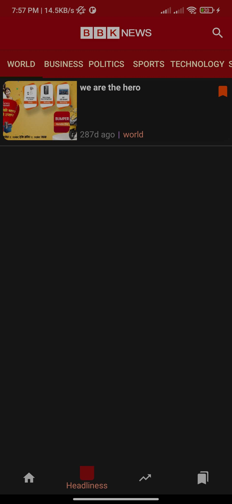

<<<<<<< HEAD
# BBK-News
=======
# Android-NewsApp
Android App to display breaking news from Guardian and NYTimes 

      

## Synopsis

This project was completed as a part of my coursework for the course CSCI 571: Web Technologies at the University of Southern California, Spring 2020 under Prof. Marco Papa.

## Why?

**Problem**: How in the world do you keep track of all hot:fire: news happening around? Way too many! It's like a Russian novel! Help! :astonished:

**Solution**: We stream the news you need and can add them to read-it-later list to read according to your convenience. We'll source, sort, summarize and quantify different news categories

## Screenshots

    
<h2>HomePage displaying news and current weather</h2>

<h2>Detailed Version of news</h2>

<h2>Section-Wise News</h2>

<h2>Trending Chart </h2>

<h2>Bookmarking functionality</h2>

<h2>Search Results</h2>

  
### Tech Stack of this Project:

* Front-end: Android(Java)
* Dependencies: Guardian News API , NYTimes News API, Twitter API, Facebook API, Trending API, Bing Autosuggest API

## Anything else?
If you need to hired professional developer then remeber me mobile no: +9779818725297

It _is_ about:

- **OSS practices**: Plentiful commits, branches, PRs!
- **Approved tech**: Many projects integrated into one!
<h3 align="center"><b>Developed by <a href="https://github.com/Bhimkndll">BHIM Kandel</a>.</b></h1>
>>>>>>> 9fbbb03 (first commit)
